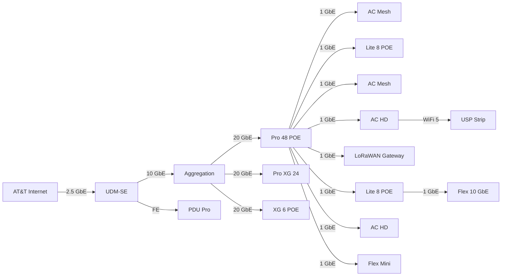

# My Homelab Network

A repository to document and store all network configurations for my personal homelab. This includes settings for Ubiquiti gear, LoRaWAN infrastructure, and various other network services.

The primary goal is to maintain a version-controlled, "infrastructure-as-code" approach to my home network, making it easier to rebuild, troubleshoot, and share ideas.

## Table of Contents

- [My Homelab Network](#my-homelab-network)
  - [Table of Contents](#table-of-contents)
  - [Network Overview](#network-overview)
    - [Topology](#topology)
    - [Hardware](#hardware)
    - [Software \& Services](#software--services)
    - [VLANs \& Subnets](#vlans--subnets)
  - [Usage](#usage)
  - [Contributing](#contributing)
  - [License](#license)
  - [Acknowledgements](#acknowledgements)

## Network Overview

Here's a high-level look at the components and structure of my home network.

### Topology

<!-- *(A network diagram is highly recommended. You can create one using tools like [diagrams.net](https://diagrams.net) (formerly draw.io), PlantUML, or even ASCII art and embed it here.)*

<!-- 
*Replace with your actual network diagram. You will need to create an `assets` directory for it.* -->

### Hardware

| Device              | Model                  | Role(s)                               | Notes                                      |
| ------------------- | ---------------------- | ------------------------------------- | ------------------------------------------ |
| Router              | Ubiquiti UDM-SE        | Gateway, Firewall, DHCP Server        | ...                                        |
| Switch              | Ubiquiti Aggregation   | Core Switch                           | ...                                        |
| Switch              | Ubiquiti Pro 48 POE    | Access Switch                         | ...                                        |
| Switch              | Ubiquiti Pro XG 24     | Access Switch                         | ...                                        |
| Switch              | Ubiquiti XG 6 POE      | Access Switch                         | ...                                        |
| Switch              | Ubiquiti Lite 8 POE    | Access Switch                         | ...                                        |
| Switch              | Ubiquiti Flex 10 GbE   | Access Switch                         | ...                                        |
| Switch              | Ubiquiti Flex Mini     | Access Switch                         | ...                                        |
| Access Point        | Ubiquiti AP AC HD      | Wi-Fi Access                          | ...                                        |
| Access Point        | Ubiquiti AP AC Mesh    | Wi-Fi Access                          | ...                                        |
| LoRaWAN Gateway     | RAK7249                | LoRaWAN Packet Forwarder              | ...                                        |
<!-- | ...                 | ...                    | ...                                   | ...                                        | -->

### Software & Services

| Service             | Platform / Host        | Purpose                               | Notes                                      |
| ------------------- | ---------------------- | ------------------------------------- | ------------------------------------------ |
| UniFi Controller    | UDM-SE                 | Manages UniFi devices                 | ...                                        |
| The Things Stack    | Community Edition      | LoRaWAN Network Server                | ...                                        |
<!-- | ...                 | ...                    | ...                                   | ...                                        | -->

### VLANs & Subnets

Proper network segmentation is key for security and management.

| VLAN ID | Name      | Subnet       | Description                                     |
| ------- | --------- | -------------| ----------------------------------------------- |
| 1       | Management| `x.x.x.x/22` | Default LAN for trusted devices & network gear. |
| 100     | Main      | `x.x.x.x/22` | Trusted personal devices (laptops, phones).     |
| 200     | IoT       | `x.x.x.x/22` | Untrusted IoT devices with limited/no internet. |
<!-- | ...                 | ...                    | ...                                   | ...                                        | -->

## Usage

While these configurations are specific to my setup, feel free to use them as a reference for your own homelab. **Do not apply these configurations directly to your network without understanding their impact.**

## Contributing

Since this is a personal repository, I'm not actively seeking contributions. However, if you spot an error or have a suggestion, please feel free to open an issue!

## License

This project is licensed under the GNU General Public License v3.0. See the LICENSE.md file for details.

## Acknowledgements

A big thanks to the communities that make homelabbing so enjoyable and educational:

- /r/homelab
- Ubiquiti Community Forums
- The Things Network Community
